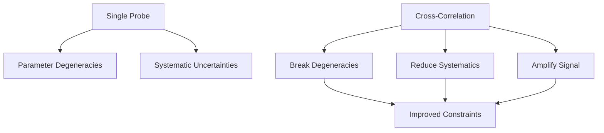

# Modified Gravity with Cross-Correlation

[](https://python.org)
[](LICENSE)
[](https://github.com/Adrita-Khan/Modified-Gravity/issues)
[](https://github.com/Adrita-Khan/Modified-Gravity/stargazers)

*Note: This project is ongoing and subject to continuous advancements and modifications.*

The project aims to **forecast the signatures of physically viable modified gravity theories** via cross-correlation analyses with precision cosmological survey data. This is a collaboration between the [Dunlap Institute](https://www.dunlap.utoronto.ca/), [CASSA](https://cassa.site/), and [CCDS](https://ccds.ai/).

---

## Why Modified Gravity?

While the ΛCDM framework fits most cosmological observations, it invokes unknown dark energy and dark matter components. Physically motivated modified gravity (MG) theories attempt to explain late-time cosmic acceleration and structure formation by altering the laws of gravity, without introducing exotic components. 

These MG models generically modify the **Poisson equation** and the relationship between metric potentials (Φ, Ψ), creating distinctive, observable imprints in cosmic structure. Such signatures can be robustly tested by galaxy clustering, CMB lensing, weak lensing observables, and their cross-correlations.

---

### Theories to be Tested

The project models the following well-motivated MG theories:

- **Hu–Sawicki f(R) Gravity:**
  - Replaces the Ricci scalar R in the Einstein-Hilbert action with a non-linear function:  
    \[ f(R) = R - \frac{c_1 m^2 (R/m^2)^n}{c_2 (R/m^2)^n + 1} \]  
    where m² ≡ H₀²Ωₘ. Key parameter: \( f_{R0} = df/dR |_{z=0} \) and typically n=1.
  - Chameleon screening suppresses modifications in high-density environments.
  - Current observations constrain |fR₀| < 10⁻⁵, selecting values within [−10⁻⁸, −10⁻⁴].

- **DGP Braneworld Gravity (nDGP branch):**
  - Large-scale leakage of gravity into extra dimensions, characterized by crossover scale rc.
  - Vainshtein screening suppresses fifth forces around massive objects.
  - We focus on the *ghost-free normal branch*. Constraints: rc ≳ 340 Mpc.

- (**Additional:** Horndeski scalar-tensor gravity may be explored where code support exists.)

---

## Why Cross-Correlation?

Cross-correlation combines information from physically uncorrelated observables to break parameter degeneracies, suppress systematic errors, and amplify signatures of new physics.



Key cross-correlation applications:

- **Galaxy–Galaxy Auto Power Spectrum (C_ell^{gg})**
- **Galaxy–CMB Lensing Cross Power (C_ell^{κg})**

These directly probe scale- and redshift-dependent modifications to gravity, and are sensitive to MG screening mechanisms.

---

## Project Description

We calculate and analyze the following angular power spectra:

- **Galaxy–Galaxy power spectrum:** \( C_\ell^{gg} \)
- **Galaxy–CMB lensing cross-power spectrum:** \( C_\ell^{κg} \)

Theoretical predictions utilize CosmoPower neural network emulators (ΛCDM baseline) and the MGemu emulator (Hu–Sawicki f(R)), with survey specifications from LSST/DESC and the Simons Observatory (SO/LAT).

---

## Goals

### Forecasting Capability

The aim is to forecast the ability of next-generation surveys to distinguish MG from GR, using:

- **Synthetic Observables:** Theoretical spectra computed with **CAMB**, **CosmoPower**, and **MGemu** (expressing ratios to ΛCDM).
- **Survey Modeling:** Integration of realistic LSST Y10 and Simons Observatory LAT survey details—tomographic bins, redshift coverage, effective galaxy density, CMB noise.
- **Fisher Matrix Analysis:** Statistical framework for parameter forecasts. (Noting limitations: assumes near-Gaussian posteriors and scale cuts. Non-Gaussianity or strong degeneracies may bias results.)
- **Degeneracy and Bias Evaluation:** Assessment of parameter covariances (e.g., fR₀–σ₈). Cross-correlation specifically helps break these.
- **Emulator Integration:** MGemu (tested for Hu-Sawicki model, k ≈ 0.01–1 h/Mpc, |fR₀| = 10⁻⁸–10⁻⁴)

---

### Literature Review Requirements
- [ ] Review linear-theory power spectra and 2PCF
- [ ] Master [HEALPix](https://healpix.sourceforge.io) and `healpy` for spherical map analysis
- [ ] Understand physical screening mechanisms (chameleon, Vainshtein) and how they impact observables
- [ ] Familiarize with [CosmoPower](https://alessiospuriomancini.github.io/cosmopower/) and [MGemu Emulator](https://github.com/LSSTDESC/mgemu)
- [ ] Survey the forecast methodology (tomographic binning, Limber approximation limits)

---

### Project Structure

```bash
├── data/                  # Simulated or observed survey inputs
├── notebooks/             # Jupyter notebooks (analysis & visualization)
├── src/                   # Core power spectrum calculation (auto/cross: GG, GCMB)
│   └── cross_power.py     # Galaxy–galaxy, galaxy–CMB, CMB–CMB power spectra
├── plots/                 # Output plots
├── configs/               # Survey specs and theory parameters
├── Dockerfile             # Containerized environment (includes GPU support)
├── README.md              # Project documentation
├── requirements.txt       # Dependencies: CosmoPower, healpy, MGemu, etc.
```

---

## Methodology

1. **Theoretical Calculation:**
   - Compute theoretical observables (C_ℓ) using baseline ΛCDM (CosmoPower) and MG models (MGemu, if supported for parameter range).
   - Parametrize MG/ΛCDM differences via modifications \( \mu(k,z), \eta(k,z) \) (e.g., \( \nabla^2 \Phi = 4\pi G \mu \rho \delta \)), updating calculations for the weak lensing kernel and growth rate.

2. **Survey Modeling:**
   - **LSST/DESC Y10:**
      - Ten redshift lens bins for clustering, up to z~3; five source bins for weak lensing[34][102]
      - Effective source density \( \bar{n} \sim 27.95~\text{arcmin}^{-2} \)[102]
      - Sky area fraction: f_sky ≈ 0.35[108]
      - Photometric redshift error: \( \langle\Delta z\rangle = 0.003(1+z) \)[109]
   - **Simons Observatory LAT:**
      - Maps ~40% sky with 1.4 arcmin resolution at 145 GHz[104]
      - Total noise \( \sim 6~\mu\text{K-arcmin} \), target for deep fields \( \sim 2.8~\mu\text{K-arcmin} \)[100][103][104]
   - Incorporate survey windows, noise properties, and shot noise \( P_{shot} = 1/\bar{n} \).

3. **Cross-Correlation:**
   - Compute auto and cross spectra for all redshift-bin combinations
   - Analyze how scale- and redshift-dependent MG signatures propagate through the kernels
   - Model galaxy bias as both linear and higher-order
   - Include RSD and shot noise effects

4. **Screening Corrections:**
   - Explicitly model **chameleon** (for f(R)) and **Vainshtein** (for DGP) screening, limiting strong modifications to cosmologically relevant scales

5. **Forecasting:**
   - Fisher matrix approach; careful selection of k_max, l_max to avoid nonlinear and poorly-screened regimes
   - Amplify constraints from multi-tracer cross-correlation
   - Quantify systematic errors due to Limber approximation and photo-z uncertainties

6. **Interpretation:**
   - Directly relate constraints on fR₀, rc, and γ growth index to deviations from ΛCDM and GR
   - Clearly state theoretical priors, parameter ranges, and degeneracy structure

---

## Key Observables: Explicit Definitions

- **Galaxy clustering angular power spectrum:**
  \[
      C_\ell^{gg} = \int dz \frac{dN}{dz}^2 \frac{H(z)}{c \chi^2(z)} P_{gg}\left(k=\frac{\ell+1/2}{\chi(z)}, z\right)
  \]
- **Galaxy–CMB lensing cross spectrum (convergence):**
  \[
      C_\ell^{\kappa g} = \int dz \frac{dN}{dz} W^\kappa(z) \frac{H(z)}{c \chi^2(z)} b_g P_{mg}\left(k=\frac{\ell+1/2}{\chi(z)}, z\right)
  \]
- **MG corrections:** Scale- and redshift-dependent modifications in P_gg, P_mg, encoded via μ(k,z), η(k,z) and screening
- Full set of equations in `/src/cross_power.py` with Limber and full-sky support

---

## **Physical & Technical Caveats**
  - **Screening:** Implement chameleon/Vainshtein screening for accurate small-scale behavior.
  - **Parameter ranges:** Use only physically and observationally viable parameter ranges (see above).
  - **Emulator validity:** Respect training limits of CosmoPower/MGemu in k, z, and MG parameters.
  - **Fisher matrix:** Only valid where posteriors are near-Gaussian; strong degeneracies weaken reliability.
  - **Photo-z and bias:** Explicitly incorporate photometric uncertainties and both linear/non-linear galaxy bias terms.
  - **Systematic error quantification:** Limber approximation, photo-z calibration, and survey inhomogeneity for robust forecasts.

---

## Contact

**Adrita Khan**  
[Email](mailto:adrita.khan.official@gmail.com) | [LinkedIn](https://www.linkedin.com/in/adrita-khan) | [Twitter](https://x.com/Adrita_)

---

*This repository offers a physically consistent, survey-specific, and code-supported framework for the analysis of modified gravity via cross-correlations. Contributions are welcome.*
