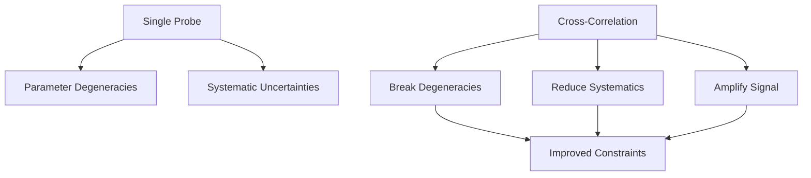

# Modified Gravity with Cross-Correlation

[](https://python.org)
[](LICENSE)
[](https://github.com/Adrita-Khan/Modified-Gravity/issues)
[](https://github.com/Adrita-Khan/Modified-Gravity/stargazers)

*Note: This project is ongoing and subject to continuous advancements and modifications.*

The project aims to **forecast the signatures of modified gravity theories** through cross-correlation analyses. It is a project of [Dunlap Institute](https://www.dunlap.utoronto.ca/) in collaboration with [CASSA](https://cassa.site/) and [CCDS](https://ccds.ai/).

---

## Why Modified Gravity?

While the ΛCDM framework fits many observations, it relies on undetected dark energy and dark matter. Modified gravity theories offer an alternative explanation for cosmic acceleration and large-scale structure formation, without invoking unknown components. These theories modify the Poisson equation and gravitational potentials, creating observable signatures in the large-scale structure of the Universe, which can be tested through galaxy clustering and weak lensing.

---

## Theories to be Tested

| Theory | Description |
|--------|-------------|
| **f(R) Gravity** | Replaces the Ricci scalar $R$ in the Einstein-Hilbert action with a function $f(R)$, predicting scale-dependent growth rates and modified lensing potentials. |
| **DGP Gravity** | A braneworld scenario where gravity leaks into an extra dimension at large scales, leading to cosmic acceleration without a cosmological constant. |


| Theory           | Description                                                  | Key Parameters                   |
| ---------------- | ------------------------------------------------------------ | -------------------------------- |
| **f(R) Gravity** | Scalar-tensor theories with modified Ricci scalar            | `f_R0`, scale-dependent growth   |
| **DGP**          | Extra-dimensional braneworld models                          | `Ω_rc`, self-accelerating branch |

---

## Why Cross-Correlation?

Cross-correlation techniques break degeneracies between cosmological parameters and reduce systematic errors by combining uncorrelated datasets.



### Advantages

| Advantage | Description |
|-----------|-------------|
| **Break degeneracies** | Between cosmological parameters |
| **Mitigate systematics** | Through uncorrelated noise cancellation |
| **Amplify signals** | Via joint analysis of multiple tracers |

### Key Observables

This method amplifies signal strength, particularly for:

| Observable | Type | Description |
|------------|------|-------------|
| **$C_\ell^{gg}$** | Galaxy–Galaxy Clustering | *Auto-correlation* |
| **$C_\ell^{\kappa g}$** | Galaxy–CMB Lensing Cross-Correlation | *Cross-correlation* |

These observables provide insights into structure growth and gravitational lensing effects, crucial for probing modified gravity.

---

## Project Description

This project involves calculating and analyzing the following power spectra:

| Power Spectrum | Type | Notation |
|----------------|------|----------|
| **Galaxy–Galaxy power spectrum** | Auto-correlation | $C_\ell^{gg}$ |
| **Galaxy–CMB lensing cross-power spectrum** | Cross-correlation | $C_\ell^{\kappa g}$ |

Both theoretical models (e.g., CosmoPower, MGemu emulator) and observational data from LSST/DESC and the Simons Observatory are used.

---

## Goals

### Forecasting Capability

The project forecasts the ability of future cosmological surveys to constrain modified gravity theories. Using mock observations and theoretical predictions, the framework evaluates how well upcoming data can differentiate between General Relativity and alternative gravity models.

#### Forecasting Pipeline Components

| Component | Description |
|-----------|-------------|
| **Synthetic Observables** | Theoretical power spectra from various MG models, using tools like **CAMB**, **MGemu Emulator**, and **PPF** formalisms |
| **Survey Modeling** | Incorporation of survey characteristics (e.g., sky coverage, galaxy density) from LSST/DESC and Simons Observatory |
| **Fisher Matrix Analysis** | Quantifies the precision of cosmological and MG parameter constraints |
| **Bias and Degeneracy Evaluation** | Assesses degeneracies between MG and ΛCDM parameters |
| **Emulator-Based Acceleration** | Speeds up parameter space exploration using **MGemu Emulator** |

This pipeline provides a **forecasting tool for MG detectability** by assessing how specific MG models affect cross-correlation observables.


---

### Key Components

| Component | Description | Tools |
|-----------|-------------|-------|
| **Synthetic Observables** | Generate theoretical power spectra | CosmoPower, MGemu Emulator |
| **Survey Modeling** | Incorporate realistic survey specifications | LSST/DESC, Simons Observatory |
| **Fisher Analysis** | Forecast parameter constraints | Custom Fisher matrix code |
| **Emulator Integration** | Accelerate parameter space exploration | Neural network interpolation |

---

## Methodology

### Theoretical Framework

| Model | Description | Key Parameters |
|-------|-------------|----------------|
| **f(R) Gravity** | Modifications to General Relativity by altering the Ricci scalar $R$ | **$f_R0$**: Amplitude of f(R) modifications |
| **DGP Gravity** | Extra dimensions affect gravitational interactions | **$\gamma$**: Growth index in DGP models |

---

### Data Acquisition

| Observatory | Data Products | Applications |
|-------------|---------------|--------------|
| **Simons Observatory (SO)** | CMB Lensing Maps, tSZ Effect | Studying large-scale structure and galaxy clusters |
| **LSST at Rubin Observatory** | Galaxy Clustering, Weak Lensing | Mapping matter density and cosmic shear |

---

### Cross-Correlation Techniques

#### Power Spectra Analysis

| Observable | Type | Notation |
|------------|------|----------|
| **Galaxy–Galaxy** | Auto-correlation | $C_\ell^{gg}$ (GG) |
| **Galaxy–CMB Lensing** | Cross-correlation | $C_\ell^{\kappa g}$ (GCMB) |

Using a **multi-tracer approach**, data from different sources are combined to enhance signal-to-noise and reduce systematics.

---

### Forecasting and Statistical Analysis

| Method | Purpose |
|--------|---------|
| **Fisher Matrix Forecasting** | Quantifies parameter constraints and breaks degeneracies between cosmological parameters |
| **Emulator-Based Acceleration** | Uses **MGemu Emulator** for rapid computation of power spectra across parameter grids |

---

### Choice of Emulators

As part of this project and research, multiple emulators were explored and integrated, including **nDGP**, **e-mantis**, **Bacco**, **MGemu**, **fRemu**, and **Cosmopower**, each offering unique capabilities for rapidly computing power spectra across different modified gravity and ΛCDM models. However, **nDGP**, **e-mantis**, and **Bacco** were ultimately selected based on performance, model coverage, and overall suitability for the analysis.


---

### Interpretation and Visualization

| Analysis Type | Description |
|---------------|-------------|
| **Parameter Sensitivity** | Assess the impact of MG parameters on observables |
| **Survey Specifications** | Simulate realistic measurements with survey details |
| **Bias Evaluation** | Identify biases and systematics in parameter estimation due to MG effects |

---

## Repository Structure

```bash
├── FREmu/                         # f(R) modified-gravity emulator
├── Notebooks/                     # Jupyter notebooks for analysis & validation
├── Scripts/                       # Pipeline scripts and utilities
├── analysis_utils/                # Shared helper functions for analysis
├── baccoemu/                      # BACCO emulator (ΛCDM + extensions)
├── baccoemu_emantis_analysis/     # Cross-analysis between BACCOemu and e-MANTIS
├── e-MANTIS/                      # Emulator for nonlinear matter power spectrum
├── mgemu/                         # Modified-gravity emulator (general MG models)
├── nDGPemu/                       # nDGP model emulator
├── plots/                         # Generated plots and figures
├── pyccl_integration/             # CCL / PyCCL integration tests and wrappers
├── survey-realism/                # Survey noise, beams, masking, & realism modules
│
├── CMB_Galaxy_Cross_Correlation_Formula_List_MG.md
│                                   # MG-specific Cℓ and cross-correlation formulas
├── Dockerfile.txt                 # Docker build configuration
├── LICENSE                        # License information
├── Limber_Eqaution_Mathematical_Formulation.md
│                                   # Limber integral and mathematical derivations
├── MG_crosscorr_README.md         # Documentation on MG cross-correlation pipeline
├── README.md                      # Project overview and instructions
├── constrain_parameters.md        # Parameter constraints summary
├── cosmo_mcmc_pipeline_algorithm.md
│                                   # MCMC pipeline description
├── cosmological_parameters_and_modified_gravity.md
│                                   # Theory background notes
├── galaxy_cmb_lensing_pipeline.md # CMB × galaxy lensing pipeline
├── mcmc_cosmological_parameters_summary.md
│                                   # Summary of inferred parameters
├── mgemu_parameter_priors.md      # Prior files for MG emulators
├── multipole-moment-lmax.md       # Notes on multipole selection and l_max
├── references.md                  # Reference list / bibliography
├── requirements.txt               # Python dependencies
├── worklog.md                     # Daily/weekly work logs

```

*This repository offers a comprehensive resource for understanding, testing, and contributing to the Modified Gravity project. It includes theoretical models, observational data, and tools for computing cross-correlated power spectra, focusing on testing theories like f(R) and DGP using advanced computational methods and survey simulations.*

---


## Survey Specifications

### LSST/DESC (Legacy Survey of Space and Time)

* **Sky Coverage:** 18,000 deg²
* **Depth:** i < 25.3 (10σ)
* **Redshift Range:** 0.1 < z < 3.0
* **Galaxy Density:** ~27 gal/arcmin²

### Simons Observatory

* **Sky Coverage:** 40% of sky
* **Angular Resolution:** 1.4' (90 GHz)
* **Sensitivity:** 2 μK-arcmin (90 GHz)
* **CMB Lensing:** κ maps to ℓ_max ~ 3000


## References

### Emulators

| Category | Emulator | Paper | Documentation |
|----------|----------|-------|---------------|
| **Modified Gravity** | **nDGP** | [Fiorini 2023](https://arxiv.org/pdf/2310.05786) | [Docs](https://github.com/BartolomeoF/nDGPemu) |
| | **e-mantis** | [Sáez-Casares 2023](https://arxiv.org/pdf/2303.08899) | [Docs](https://e-mantis.pages.obspm.fr/e-mantis/main/index.html) |
| **LambdaCDM** | **Bacco** | [Aricò 2020](https://arxiv.org/pdf/2011.15018) | [Docs](https://baccoemu.readthedocs.io/) |

### Statistical & Sampling Tools

| Tool | Documentation |
|------|---------------|
| **emcee** | [emcee.readthedocs.io](https://emcee.readthedocs.io/en/stable/) |
| **pocoMC** | [pocomc.readthedocs.io](https://pocomc.readthedocs.io/en/latest/) |
| **Corner** | [corner.readthedocs.io](https://corner.readthedocs.io/en/latest/) |
| **GetDist** | [getdist.readthedocs.io](https://getdist.readthedocs.io/en/latest/) |

### Astropy Cosmology

#### General Resources

| Resource | Link |
|----------|------|
| Overview | [docs.astropy.org/en/stable/cosmology/](https://docs.astropy.org/en/stable/cosmology/index.html) |
| Base API | [astropy.cosmology.Cosmology](https://docs.astropy.org/en/latest/api/astropy.cosmology.Cosmology.html) |
| Units | [cosmology/units](https://docs.astropy.org/en/latest/cosmology/units.html) |

#### Cosmological Models

| Model | Documentation |
|-------|---------------|
| **LambdaCDM** | [astropy.cosmology.LambdaCDM](https://docs.astropy.org/en/stable/api/astropy.cosmology.LambdaCDM.html) |
| **FlatLambdaCDM** | [astropy.cosmology.FlatLambdaCDM](https://docs.astropy.org/en/stable/api/astropy.cosmology.FlatLambdaCDM.html) |
| **FlatwCDM** | [astropy.cosmology.FlatwCDM](https://docs.astropy.org/en/stable/api/astropy.cosmology.FlatwCDM.html) |
| **FLRW** | [astropy.cosmology.FLRW](https://docs.astropy.org/en/stable/api/astropy.cosmology.FLRW.html) |

#### Utilities

| Utility | Documentation |
|---------|---------------|
| **Planck18** | [astropy.cosmology.realizations.Planck18](https://docs.astropy.org/en/latest/api/astropy.cosmology.realizations.Planck18.html) |
| **Redshift-Distance Units** | [cosmology.units.redshift_distance](https://docs.astropy.org/en/stable/api/astropy.cosmology.units.redshift_distance.html) |

### Angular Power Spectra & Correlations

| Tool | Resources |
|------|-----------|
| **NaMaster** | [GitHub](https://github.com/LSSTDESC/NaMaster) • [Docs](https://namaster.readthedocs.io/en/latest/) • [Covariances](https://namaster.readthedocs.io/en/latest/3Covariances.html) |
| **CCL** | [Docs](https://ccl.readthedocs.io/en/latest/) |

### LSSTDESC Tutorials

| Topic | Notebook |
|-------|----------|
| C_ℓ in pyccl | [CellsCorrelations.ipynb](https://github.com/LSSTDESC/CCLX/blob/master/CellsCorrelations.ipynb) |
| Emulators (Bacco) | [Cosmological_Emulator.ipynb](https://github.com/LSSTDESC/CCLX/blob/master/Cosmological_Emulator.ipynb) |
| Tomographic bins | [LSST_SRD_Redshift_Distributions_and_Binning.ipynb](https://github.com/LSSTDESC/CCLX/blob/master/LSST_SRD_Redshift_Distributions_and_Binning.ipynb) |
| emcee + pyccl | [MCMC Likelihood Analysis.ipynb](https://github.com/LSSTDESC/CCLX/blob/master/MCMC%20Likelihood%20Analysis.ipynb) |

### HEALPix/healpy

| Resource | Link |
|----------|------|
| **healpy GitHub** | [github.com/healpy/healpy](https://github.com/healpy/healpy) |
| **healpy Docs** | [healpy.readthedocs.io](https://healpy.readthedocs.io/en/latest/) |
| **Tutorial** | [healpy-sims.ipynb](https://github.com/tanveerkarim/myTutorials/blob/main/notebooks/healpy-sims.ipynb) |

*More references can be found in the extended reference list: [here](https://github.com/Adrita-Khan/Modified-Gravity/blob/main/references.md)*

---

## Contact

**Adrita Khan**  
[Email](mailto:adrita.khan.official@gmail.com) | [LinkedIn](https://www.linkedin.com/in/adrita-khan) | [Twitter](https://x.com/Adrita_)
