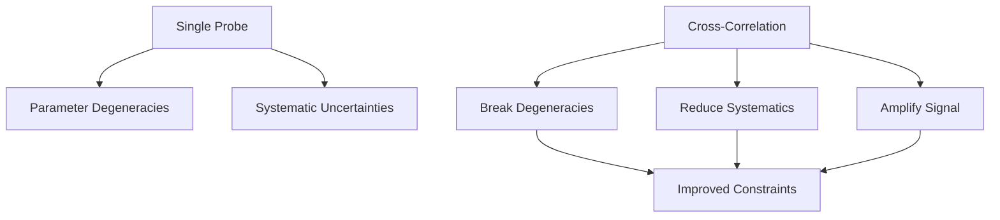

Here is the version without emojis:

# Modified Gravity Cross-Correlation Analysis

[](https://python.org)
[](https://camb.info)
[](LICENSE)

A comprehensive framework for testing modified gravity theories through cross-correlation analysis of large-scale structure observables.

## Overview

The ΛCDM cosmological model successfully explains many observations but relies on undetected dark energy and dark matter. This project explores **modified gravity (MG) theories** as alternatives that can explain cosmic acceleration and structure formation without invoking dark components.

Our approach uses **cross-correlation techniques** to test MG theories by analyzing:

* Galaxy–Galaxy clustering
* Galaxy–CMB lensing correlations
* CMB lensing auto-correlations

## Quick Start

```bash
# Clone the repository
git clone https://github.com/your-username/modified-gravity-cross-correlation.git
cd modified-gravity-cross-correlation

# Install dependencies
pip install -r requirements.txt

# Run example analysis
python src/cross_power.py --config configs/lsst_simons.yaml
```

## Modified Gravity Theories

### Currently Supported Models

| Theory           | Description                                                  | Key Parameters                   |
| ---------------- | ------------------------------------------------------------ | -------------------------------- |
| **f(R) Gravity** | Scalar-tensor theories with modified Ricci scalar            | `f_R0`, scale-dependent growth   |
| **Horndeski**    | Most general scalar-tensor theories with 2nd-order equations | `α_M`, `α_K`, `α_B`, `α_T`       |
| **DGP**          | Extra-dimensional braneworld models                          | `Ω_rc`, self-accelerating branch |

### Planned Extensions

* [ ] Galileon models
* [ ] Chameleon screening mechanisms
* [ ] Symmetron theories

## Cross-Correlation Methodology

### Why Cross-Correlation?



**Advantages:**

* **Break degeneracies** between cosmological parameters
* **Mitigate systematics** through uncorrelated noise cancellation
* **Amplify signals** via joint analysis of multiple tracers

### Observable Combinations

1. **Galaxy–Galaxy (GG)** clustering: `P_gg(k,z)`
2. **Galaxy–CMB lensing (Gκ)**: `P_gκ(k,z)`
3. **CMB lensing auto-correlation (κκ)**: `P_κκ(k,z)`

## Forecasting Pipeline

Our framework provides end-to-end forecasting capabilities for upcoming surveys:

```python
# Example forecasting workflow
from src.forecasting import MGForecast
from src.surveys import LSST, SimonsObservatory

# Initialize forecast
forecast = MGForecast(
    theories=['fR', 'Horndeski'],
    surveys=[LSST(), SimonsObservatory()],
    observables=['GG', 'Gκ', 'κκ']
)

# Run Fisher analysis
constraints = forecast.fisher_analysis()
forecast.plot_constraints(constraints)
```

### Key Components

| Component                 | Description                        | Tools                         |
| ------------------------- | ---------------------------------- | ----------------------------- |
| **Synthetic Observables** | Generate theoretical power spectra | CAMB, MGmu Emulator           |
| **Survey Modeling**       | Realistic survey specifications    | LSST/DESC, Simons Observatory |
| **Fisher Analysis**       | Parameter constraint forecasting   | Custom Fisher matrix code     |
| **Emulator Integration**  | Fast parameter space exploration   | Neural network interpolation  |

## Repository Structure

```
modified-gravity-cross-correlation/
├── data/                    # Input data and simulations
│   ├── lsst/                   # LSST survey specifications
│   ├── simons/                 # Simons Observatory data
│   └── theory/                 # Theoretical predictions
├── notebooks/               # Analysis notebooks
│   ├── 01_introduction.ipynb  # Project overview
│   ├── 02_theory_review.ipynb # MG theory background
│   └── 03_forecasting.ipynb   # Forecasting examples
├── src/                     # Core source code
│   ├── cross_power.py          # Power spectrum calculations
│   ├── forecasting.py          # Fisher matrix analysis
│   ├── surveys.py              # Survey specifications
│   ├── theories/               # MG theory implementations
│   │   ├── fr_gravity.py       # f(R) models
│   │   ├── horndeski.py        # Horndeski theories
│   │   └── dgp.py              # DGP braneworld
│   └── utils/                  # Utility functions
│       ├── cosmology.py        # Cosmological calculations
│       └── plotting.py         # Visualization tools
├── plots/                   # Generated figures
├── configs/                 # Configuration files
│   ├── lsst_specs.yaml         # LSST survey parameters
│   ├── simons_specs.yaml       # Simons Observatory setup
│   └── theory_params.yaml      # MG model parameters
├── docker/                  # Docker environment
│   ├── Dockerfile              # Main container
│   └── docker-compose.yml      # Multi-service setup
├── tests/                   # Unit tests
├── requirements.txt         # Python dependencies
├── setup.py                 # Package installation
└── README.md               # This file
```

## Installation & Setup

### Option 1: Local Installation

```bash
# Clone repository
git clone https://github.com/your-username/modified-gravity-cross-correlation.git
cd modified-gravity-cross-correlation

# Create virtual environment
python -m venv venv
source venv/bin/activate  # On Windows: venv\Scripts\activate

# Install dependencies
pip install -r requirements.txt

# Install package in development mode
pip install -e .
```

### Option 2: Docker (Recommended for GPU acceleration)

```bash
# Build Docker image
docker build -t mg-analysis .

# Run with GPU support
docker run --gpus all -v $(pwd):/workspace mg-analysis
```

### Dependencies

**Core Requirements:**

* `numpy >= 1.20.0`
* `scipy >= 1.7.0`
* `matplotlib >= 3.4.0`
* `camb >= 1.3.0`
* `healpy >= 1.15.0`

**Optional (for acceleration):**

* `jax >= 0.3.0` - JAX for GPU acceleration
* `tensorflow >= 2.8.0` - Neural network emulators

## Usage Examples

### Basic Power Spectrum Calculation

```python
from src.cross_power import CrossPowerSpectrum
from src.theories.fr_gravity import fRGravity

# Initialize f(R) gravity model
theory = fRGravity(f_R0=-1e-5)

# Calculate cross-power spectra
cross_power = CrossPowerSpectrum(theory=theory)
k, P_gg = cross_power.galaxy_galaxy(z=0.5)
k, P_gk = cross_power.galaxy_cmb_lensing(z=0.5)
k, P_kk = cross_power.cmb_lensing_auto()
```

### Fisher Forecast Analysis

```python
from src.forecasting import FisherForecast

# Set up Fisher analysis
fisher = FisherForecast(
    theories=['fR', 'Horndeski'],
    parameters=['f_R0', 'alpha_M', 'alpha_K'],
    fiducial_values=[-1e-5, 0.1, 0.1]
)

# Run forecast
results = fisher.forecast_constraints(
    survey='LSST_Y10',
    observables=['GG', 'Gκ', 'κκ']
)

# Plot results
fisher.plot_ellipses(results, filename='plots/fisher_constraints.png')
```

## Roadmap & Milestones

### Phase 1: Foundation (Months 1-3)

* [x] Project setup and repository structure
* [ ] Literature review completion

  * [ ] Power spectrum and 2PCF under linear theory
  * [ ] HEALPix and `healpy` familiarization
  * [ ] Modified gravity theory review (f(R), Horndeski, DGP)
  * [ ] CAMB implementation and usage
  * [ ] MGmu Emulator integration

### Phase 2: Core Development (Months 4-6)

* [ ] Power spectrum calculation functions

  * [ ] Galaxy–Galaxy clustering
  * [ ] Galaxy–CMB lensing cross-correlation
  * [ ] CMB lensing auto-correlation
* [ ] Survey specification integration

  * [ ] LSST/DESC parameters
  * [ ] Simons Observatory specifications
* [ ] Optimization with JAX/neural networks

### Phase 3: Analysis & Validation (Months 7-9)

* [ ] Theoretical vs observational comparison
* [ ] Modified gravity model interpretation
* [ ] Fisher matrix forecasting
* [ ] Systematic uncertainty analysis

### Phase 4: Extensions (Months 10-12)

* [ ] Additional MG theories
* [ ] Machine learning emulators
* [ ] Real data application
* [ ] Publication preparation

## Contributing

We welcome contributions! Please see our [Contributing Guidelines](CONTRIBUTING.md) for details.

### Development Workflow

1. Fork the repository
2. Create a feature branch (`git checkout -b feature/amazing-feature`)
3. Make changes and add tests
4. Commit changes (`git commit -m 'Add amazing feature'`)
5. Push to the branch (`git push origin feature/amazing-feature`)
6. Open a Pull Request

### Code Style

* Follow PEP 8 for Python code
* Use type hints where appropriate
* Add docstrings for all functions and classes
* Include unit tests for new functionality

## Survey Specifications

### LSST/DESC (Legacy Survey of Space and Time)

* **Sky Coverage:** 18,000 deg²
* **Depth:** i < 25.3 (10σ)
* **Redshift Range:** 0.1 < z < 3.0
* **Galaxy Density:** ~27 gal/arcmin²

### Simons Observatory

* **Sky Coverage:** 40% of sky
* **Angular Resolution:** 1.4' (90 GHz)
* **Sensitivity:** 2 μK-arcmin (90 GHz)
* **CMB Lensing:** κ maps to ℓ_max ~ 3000

## Resources & References

### Documentation

* [CAMB Documentation](https://camb.readthedocs.io) - Cosmological parameter calculation
* [MGmu Emulator](https://github.com/LSSTDESC/mgemu) - Fast MG power spectra
* [HEALPix](https://healpix.sourceforge.io) - Spherical pixelization scheme

### Key Papers

* Hu & Sawicki (2007) - f(R) gravity models
* Horndeski (1974) - General scalar-tensor theories
* LSST Science Collaboration (2009) - LSST science case
* Simons Observatory Collaboration (2019) - Survey overview

### Collaborations

* [LSST DESC](https://www.lsst.org/scientists/dark-energy-science-collaboration) - Dark Energy Science Collaboration
* [Simons Observatory](https://simonsobservatory.org) - Next-generation CMB experiment

## License

This project is licensed under the MIT License - see the [LICENSE](LICENSE) file for details.

## Acknowledgments

* LSST DESC for survey specifications and theoretical framework
* Simons Observatory collaboration for CMB data products
* CAMB developers for cosmological calculations
* MGmu Emulator team for neural network implementations

---

**Contact:** [here](mailto:adrita.khan.official@gmail.com)

**Citation:** If using this code in research, please cite:

```bibtex
@software{modified_gravity_analysis,
  title={Modified Gravity Cross-Correlation Analysis},
  author={Your Name},
  year={2024},
  url={https://github.com/your-username/modified-gravity-cross-correlation}
}
```
